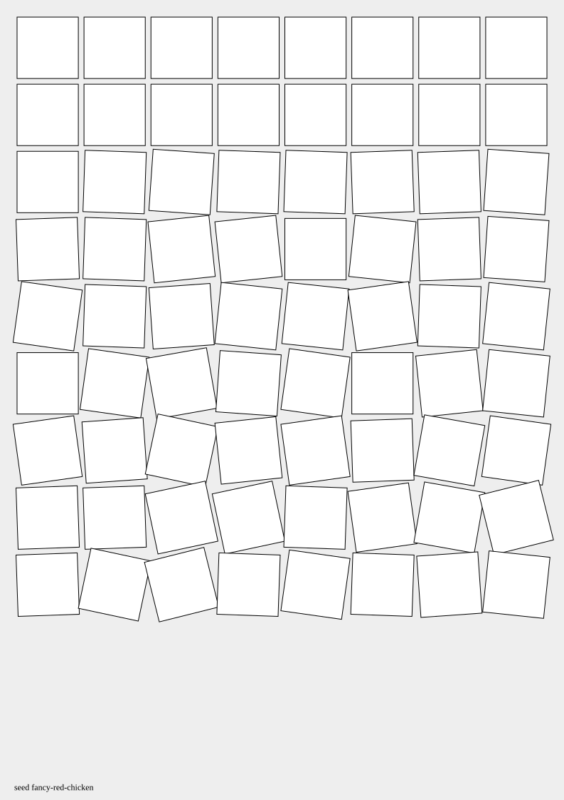

# Vormen

_Vormen_ is a bag of tools, modules and scripts for creating generative art in
SVG using Javascript

## Features

- Classes, functions and modules used in your code to easily create artwork in
  SVG.
- An optional runner module that turns your drawing into a program: render it to
  an SVG file, or serve it in a browser with a settings UI.
- Tools to run your code in a browser and interact with the SVG there

> [!WARNING]
> This is very early, alpha code. The examples below may not be implemented yet,
> or may not work anymore.

## Quickstart

> [!NOTE]
> Examples below use [deno](https://deno.com/). The final library will be usable
> on any javascript or typescript platform. node, npm, yarn, bun etc.

Create a new project and add the dependency:
`deno init my-drawing && deno add jsr:@berkes/vormen`

Edit a file, e.g. drawing.ts. Your drawing is a program: it defines a `draw`
function that takes settings and returns a `string`, then hands that function to
the runner as its last line. Here's a full example:

```Javascript
import { Drawing, Grid, Noise, Settings, Vormen } from "@berkes/vormen";

const defaultSettings = new Settings({
  rotationStrength: 35,
});

const draw = (settings) => {
  // Create a drawing with a4 size, equal margins on all sides and a white background.
  const drawing = new Drawing().withA4Size().withMargin(20).withBackground(
    "white",
  );
  // From this drawing, we extract the area that we can draw on.
  const canvas = drawing.build();

  // Another utility is a grid. This allows us to put stuff in a grid.
  // Here we creat a 8x9 grid, each cell is padded 4 units and cells are square.
  const grid = new Grid().rows(9).columns(8).padding(4).squareCells();

  // Another utility is a seedable noise generator. Simplex noise.
  const noise = new Noise("seeeed");

  // The grit in action: loop over all cells
  grid.cells().forEach((cell) => {
    // And finally we use the svg.js API to create some rectangles
    let square = canvas
      .rect(cell.innerWidth, cell.innerHeight) // Use the grid to find the sizes of the squares
      .fill("none")
      .stroke({ width: 1, color: "black" })
      .move(cell.x, cell.y) // Use the grid to position the square
      .rotate(
        // Use the noise to randomly rotate this square
        // Apply a setting that controls how much the cells will be rotated
        noise.get(cell.x, cell.y) * (cell.row * settings.rotationStrength),
      );
  });

  return drawing;
};

Vormen(draw, defaultSettings);
```

In this example, we see a lot of things coming together.

We can run it to generate an SVG:

```bash
deno run drawing.ts render --outfile drawing.svg
```

 (This is generated with
[examples/cubic-disarray.ts](examples/cubic-disarray.ts])

Or output to stdout.

```bash
deno run drawing.ts render --outfile - > drawing.svg
```

Or override settings

```bash
deno run drawing.ts render --outfile drawing.svg --setting.rotationStrength=10
```

## Pick and Choose

The full example above is by no means how it must be set up. This is not a
framework. It is a library that you can pick and choose from.

Just use the runner, by passing it a function that returns the SVG as string.

```javascript
import { Vormen } from "@berkes/vormen";

const draw = (_settings) => {
  return `<svg xmlns="http://www.w3.org/2000/svg" xmlns:xlink="http://www.w3.org/1999/xlink" width="100" height="100" viewBox="0 0 100 100">
    <rect x="10" y="10" width="80" height="80" fill="red" />
  </svg>`;
};

Vormen(draw, {});
```

Or just the page builder, by letting that create the SVG string and then
`console.log()` that, or write it to a file.

```javascript
import { writeFileSync } from "node:fs";
import { Drawing } from "@berkes/vormen";

const drawing = new Drawing().withA4Size().withMargin(20);
const canvas = drawing.build();

for(i = 0, i < 8, i++) {
  for(j = 0, j < 9, j++) {
    const x = i * 10;
    const y = j * 10;
    canvas.rect(10, 10).x(x).y(y);
  }
}

writeFileSync('mydrawing.svg', drawing.svg());
```

All modules should be usable without requiring the others (this is work in
progress, some requirements exist that will be removed).

See below for a full list of modules and their usage.

## Examples

The `examples/` directory holds runnable drawings.

You can run these with `deno run examples/thefile.ts` after you check out the
source code of this repo.

## Modules

> [!WARNING]
> Modules documentation is WIP. So incomplete and probably out of date

### Vormen

Main execution module for running drawings. Contains the Vormen function,
render, and serve.

We assume `deno run drawing.ts` where `drawing.ts` uses `Vormen`.

- `deno run drawing.ts serve` will open a web app with the rendered drawing and
  a GUI with tools to play with it. Additionally, any settings will create a
  widget next to the drawing which we can adjust settings and have the drawing
  re-rendered with the changes.
- `deno run drawing.ts render --outfile file.svg` will render the svg to the
  file. Additionally, any settings can be overridden with
  `--setting.theSettingName=bar` to render with that setting instead of the
  default from the drawing.

In future, we should be able to use `node drawing.js`, `npx`, `node run`, `yarn`
or any runtime that can execute a javascript (or typescript) file.

### Drawing

The basis of SVG creation. Contains the Drawing class for building SVG artwork
with paper sizes, margins, and backgrounds. This is a simplified API that wraps
svg.js to create drawings with paper size presets (A3, A4, A5), margin support,
and background color support.

### Grid

A grid system for organizing cells in a drawing. Contains Grid and Cell classes.
Grid uses the builder pattern for configuration and is iterable over its cells,
yielding Cell objects that provide position and dimension information. The grid
isn't visible, but allows us to position elements in a grid with easy tools like
being able to loop over all the cells, get X and Y coordinates of a cell, add
paddings between cells and so on.

### Math

Calculation utilities, randomness, and noise generation. Contains constrain,
Random, Noise, and Stringifiable.

- **constrain**: Constrains a value between a minimum and maximum
- **Random**: Seeded pseudo-random number generator with methods like between()
  and betweenFloat()
- **Noise**: Seeded Simplex noise generator for reproducible noise generation.
  Use the get(x, y) method to sample noise values.

Random and Noise are seeded, so we have reproducible results.

> [!NOTE]
> We will add many of the utilities from `p5.js`, but slightly stricter
> implemented to allow for better type checking and better documentation.

### Primitives

Geometric primitives for vector mathematics. Contains Vector. These are objects
that aren't drawn, but typically used when simulating or calculating and then
drawing the results. The Vector class represents a 2D vector with x and y
components and provides operations like distance calculation and lerping.

### Settings

Configuration management for drawings. Contains the Settings class for managing
drawing parameters. Provides type-safe accessors for string, number, and boolean
values, and supports merging settings from multiple sources.

### Development

The project uses Deno for development. Run tests with `deno test -P` (-P to
allow the default deno permissions)

## Releases

Releases are built by CI. To publish one, push a tag that starts with `v` (for
example `v1.2.3`).

## Future

- Finalize all the Math tools, primitives and other utilities
- Support for custom Shapes that can be re-used and output (larger) svg
  structures
- Ergonomic abstractions over bezier paths and other complex organic shapes
- Ergonomic abstractions over layers
- Predefined common and often used filters, gradients, masks, and patterns
- Ability to use and run with `node`, `yarn`, `npx` and `bun`, not just deno
- Debug rendering. E.g. Grid already has some beginning.
- Utilities like "simplify" and "optimize" through external tools allowing for
  smaller svg files
- Ergonomic CSS abstractions
- Animation through CSS transforms
- Animation and interaction through javascript in the SVG

## No-Goals

- Not meant to create svg in a browser or web app. Plenty of libraries like
  svg.js, d3.js, etc. already do that.
- Not meant to be a full graphics library. It's meant to be a tool to create svg
  files.
- No support for shaders, sound, video, etc. For that, you are free to import
  any other dependency in a drawing file.
