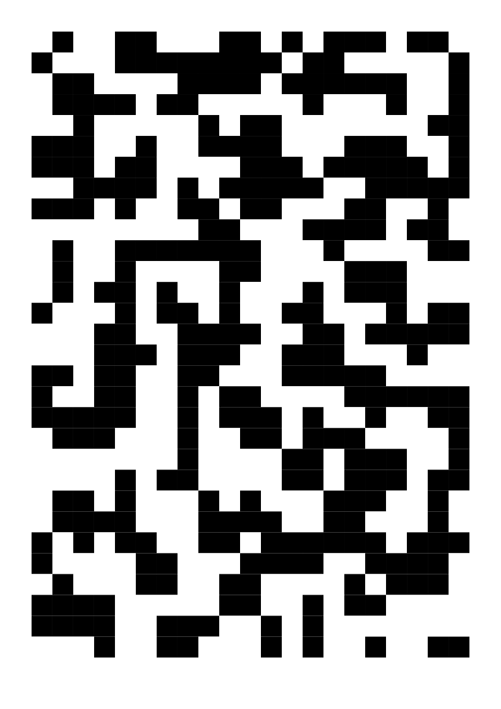
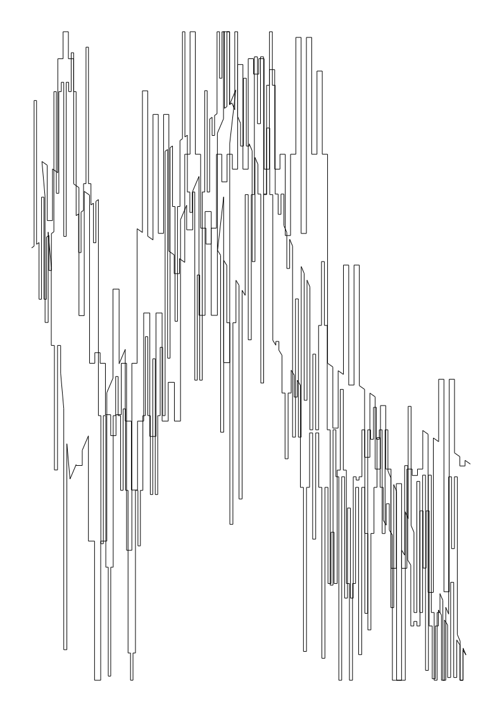

# vormen

A Rust library for creating generative SVG artwork. Built with `svg`, `noise`, and `rand`.

## Examples

### noodlelove

Generates a tiled pattern using rotated noodle tiles based on Simplex noise.

```bash
cargo run --example noodle_love
```

TODO: fix embedding of images

### perlin_grid

Creates a black and white grid based on Perlin noise values.

```bash
cargo run --example perlin_grid
```



### split_city

Generates a city skyline using iterative subdivision of lines.

```bash
cargo run --example split_city
```



## Features

- SVG document generation with A4 paper support
- Grid layouts with configurable columns and rows
- Color utilities
- Integration with noise libraries for procedural generation

## Usage

Add to your `Cargo.toml`:

```toml
[dependencies]
vormen = "0.2.0"
```

See the [examples](./examples) directory for usage patterns.
