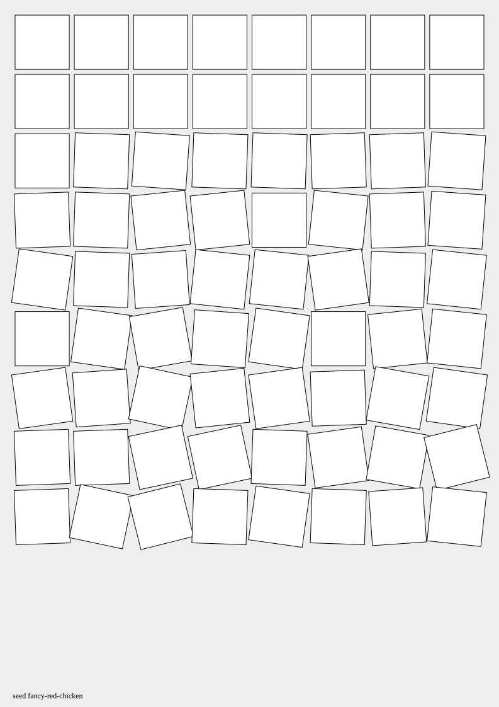
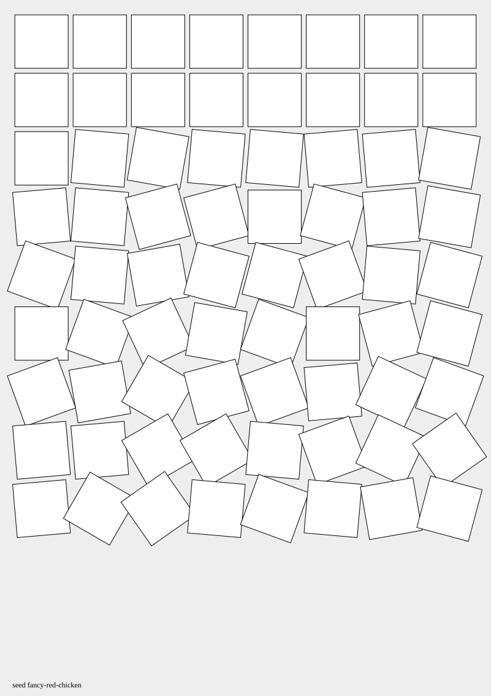

# Cubic Disarray

Cubic Disarray, after Georg Nees: a grid of white squares whose rotation grows
stronger towards the bottom rows, on an A4 page with a gray background.

The rotation strength is a setting: the higher it is, the more the squares
scatter. Both SVGs below use the same seed and only differ in the
`rotationStrength` setting (`2` and `5`).

Source: [examples/cubic-disarray.ts](../../../examples/cubic-disarray.ts)
