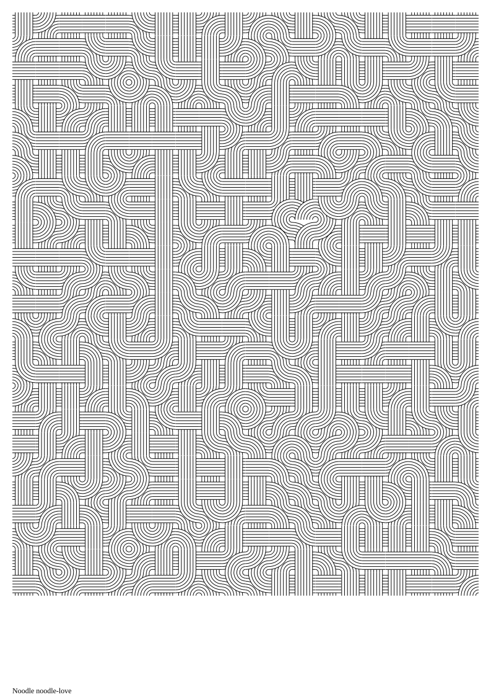

# Noodle Love

A grid of round and cross tiles, each placed in a cell and rotated by a random
multiple of 90 degrees, with a heart in the center. It showcases grids with
square cells, the seedable `Random` generator, and reusing external SVG assets
with `readSvg` and defs.

Source: [examples/noodle_love.ts](../../../examples/noodle_love.ts)
